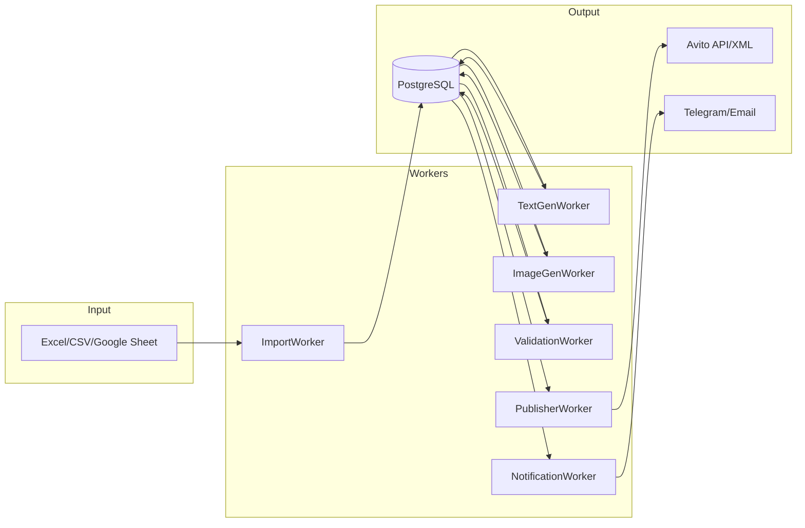

# AdsGen 2.0: Миграция на Worker-Based Микросервисную Архитектуру

## Описание Проекта

Полная реструктуризация AdsGen — системы автоматической генерации объявлений для Avito. Текущая монолитная логика в Google Apps Script будет разделена на независимые Docker-контейнеры (воркеры), связанные через очереди сообщений.

### Текущая Архитектура (Google Apps Script)
- [avito-vacancies-v3.gs](file:///d:/%D0%9A%D0%BE%D0%B4/AdsGen_2/avito-vacancies-v3.gs) — основная логика: импорт, AI-генерация текстов, генерация картинок, формирование объявлений
- [templates.gs](file:///d:/%D0%9A%D0%BE%D0%B4/AdsGen_2/templates.gs) — шаблоны профессий, маппинг должностей
- [importData.gs](file:///d:/%D0%9A%D0%BE%D0%B4/AdsGen_2/importData.gs) — импорт данных из внешних Google Таблиц
- [genXML.gs](file:///d:/%D0%9A%D0%BE%D0%B4/AdsGen_2/genXML.gs) — экспорт в XML для Avito
- [duplicate.gs](file:///d:/%D0%9A%D0%BE%D0%B4/AdsGen_2/duplicate.gs) — дедупликация картинок

### Новая Архитектура (Docker Workers)


---

## Предлагаемый Технологический Стек

| Компонент | Технология | Обоснование |
|-----------|------------|-------------|
| **Язык** | Python 3.12 | Богатая экосистема AI/ML, простота, async |
| **HTTP Framework** | FastAPI | Async, OpenAPI docs, валидация Pydantic |
| **Task Queue** | Celery + Redis | Надежные очереди, retry, мониторинг |
| **Database** | PostgreSQL | ACID, JSON поддержка, надёжность |
| **ORM** | SQLAlchemy 2.0 | Async, миграции через Alembic |
| **Cache/Broker** | Redis | Быстрый брокер для Celery |
| **Container** | Docker + Docker Compose | Локальный запуск, масштабирование |
| **AI Text** | DeepSeek API (уже используется) | Сохраняем текущую интеграцию |
| **AI Image** | ComfyUI (уже настроен) | Локальный сервер генерации |
| **Storage** | Yandex Disk (уже используется) | Хранение сгенерированных картинок |
| **Monitoring** | Flower (Celery UI) | Мониторинг задач |

---

## User Review Required

> [!IMPORTANT]
> **Выбор технологического стека** — нужно ваше подтверждение по выбору Python/FastAPI/Celery/Redis/PostgreSQL. Альтернативы:
> - **Node.js + BullMQ** — если предпочитаете JavaScript
> - **Go + NATS** — для высокой производительности
> - **Python + RQ** — упрощенная альтернатива Celery

> [!WARNING]
> **Google Sheets интеграция** — после миграции Google Таблица будет использоваться ТОЛЬКО для отображения данных. Вся логика обработки переезжает в воркеры. Нужно решить, как таблица будет получать обновления:
> - **Вариант A**: Web App с периодическими запросами к API воркеров
> - **Вариант B**: Apps Script как тонкий клиент, читающий данные из PostgreSQL через REST API
> - **Вариант C**: Полный отказ от Google Sheets, переход на веб-интерфейс

> [!CAUTION]
> **Локальный ComfyUI** — текущий ImageGenWorker использует туннель `tuna.am`. Для production рекомендуется использовать облачный сервис или VPS с GPU.

---

## Proposed Changes

### Структура проекта

```
d:\Код\AdsGen_2\
├── docker-compose.yml          # [NEW] Оркестрация всех сервисов
├── .env.example                 # [NEW] Шаблон переменных окружения
├── services/
│   ├── shared/                  # [NEW] Общие модули
│   │   ├── models/              # SQLAlchemy модели
│   │   ├── schemas/             # Pydantic схемы
│   │   ├── database.py          # Подключение к БД
│   │   └── config.py            # Настройки
│   │
│   ├── import_worker/           # [NEW] Воркер импорта
│   │   ├── Dockerfile
│   │   ├── requirements.txt
│   │   ├── main.py              # FastAPI endpoints
│   │   ├── tasks.py             # Celery tasks
│   │   └── parsers/             # Парсеры Excel/CSV/GSheets
│   │
│   ├── textgen_worker/          # [NEW] Воркер генерации текста
│   │   ├── Dockerfile
│   │   ├── requirements.txt
│   │   ├── main.py
│   │   ├── tasks.py
│   │   └── prompts/             # AI промпты
│   │
│   ├── imagegen_worker/         # [NEW] Воркер генерации картинок
│   │   ├── Dockerfile
│   │   ├── requirements.txt
│   │   ├── main.py
│   │   ├── tasks.py
│   │   └── comfyui_client.py    # Интеграция с ComfyUI
│   │
│   ├── validation_worker/       # [NEW] Воркер валидации
│   │   ├── Dockerfile
│   │   ├── requirements.txt
│   │   ├── main.py
│   │   ├── tasks.py
│   │   └── rules/               # Правила Avito
│   │
│   ├── publisher_worker/        # [NEW] Воркер публикации
│   │   ├── Dockerfile
│   │   ├── requirements.txt
│   │   ├── main.py
│   │   ├── tasks.py
│   │   └── avito_client.py      # Avito API клиент
│   │
│   └── notification_worker/     # [NEW - опционально]
│       ├── Dockerfile
│       ├── requirements.txt
│       ├── main.py
│       └── tasks.py
│
├── google-scripts/              # [MODIFY] Упрощённые GAS скрипты
│   ├── thin-client.gs           # [NEW] Тонкий клиент для отображения
│   └── sync-data.gs             # [NEW] Синхронизация с API
│
└── legacy/                      # [MOVE] Текущие GAS скрипты для справки
    ├── avito-vacancies-v3.gs
    ├── templates.gs
    ├── importData.gs
    ├── genXML.gs
    └── duplicate.gs
```

---

### 1. Shared (Общие модули)

#### [NEW] [models.py](file:///d:/Код/AdsGen_2/services/shared/models/vacancy.py)

Модели SQLAlchemy для вакансий, задач, статусов:

```python
class Vacancy(Base):
    id: str                    # Уникальный ID (M123456789)
    city: str                  # Город
    address: str               # Адрес
    position: str              # Должность (исходная)
    profession: str            # Профессия Avito (mapped)
    schedule: str              # График
    salary_min: int            # Мин. зарплата
    salary_max: int            # Макс. зарплата
    store_type: str            # Тип магазина (ГМ/МФ)
    service: str               # Услуга
    
    # Сгенерированный контент
    title: str                 # Заголовок объявления
    description: str           # Описание (HTML)
    image_url: str             # URL картинки
    
    # Статусы
    status: VacancyStatus      # PENDING/TEXT_GENERATED/IMAGE_GENERATED/VALIDATED/PUBLISHED/ERROR
    avito_ad_id: str           # ID объявления на Avito
    error_message: str         # Ошибка (если есть)
    
    created_at: datetime
    updated_at: datetime
```

---

### 2. ImportWorker

#### [NEW] [tasks.py](file:///d:/Код/AdsGen_2/services/import_worker/tasks.py)

Логика из [importData.gs](file:///d:/%D0%9A%D0%BE%D0%B4/AdsGen_2/importData.gs):
- Парсинг Excel/CSV через `pandas`
- Подключение к Google Sheets через `gspread`
- Фильтрация по городам, релевантности
- Генерация уникальных ID
- Создание записей в PostgreSQL со статусом `PENDING`

---

### 3. TextGenWorker

#### [NEW] [tasks.py](file:///d:/Код/AdsGen_2/services/textgen_worker/tasks.py)

Логика из [avito-vacancies-v3.gs](file:///d:/%D0%9A%D0%BE%D0%B4/AdsGen_2/avito-vacancies-v3.gs):
- Функции [generateAiVacancyContent()](file:///d:/%D0%9A%D0%BE%D0%B4/AdsGen_2/avito-vacancies-v3.gs#786-875), [generateUniqueTitle()](file:///d:/%D0%9A%D0%BE%D0%B4/AdsGen_2/avito-vacancies-v3.gs#79-90), [generateDescription()](file:///d:/%D0%9A%D0%BE%D0%B4/AdsGen_2/avito-vacancies-v3.gs#91-113)
- Промпты для DeepSeek (мигрируем из GAS)
- Обновление статуса на `TEXT_GENERATED`

---

### 4. ImageGenWorker

#### [NEW] [tasks.py](file:///d:/Код/AdsGen_2/services/imagegen_worker/tasks.py)

Логика из [avito-vacancies-v3.gs](file:///d:/%D0%9A%D0%BE%D0%B4/AdsGen_2/avito-vacancies-v3.gs):
- Функции [generateImage()](file:///d:/%D0%9A%D0%BE%D0%B4/AdsGen_2/avito-vacancies-v3.gs#133-179), [translateToEnglish()](file:///d:/%D0%9A%D0%BE%D0%B4/AdsGen_2/avito-vacancies-v3.gs#180-202), [getProfessionImage()](file:///d:/%D0%9A%D0%BE%D0%B4/AdsGen_2/avito-vacancies-v3.gs#114-132)
- HTTP клиент для ComfyUI (существующий туннель)
- Загрузка на Yandex Disk (существующая интеграция)
- Статус `IMAGE_GENERATED`

---

### 5. ValidationWorker

#### [NEW] [tasks.py](file:///d:/Код/AdsGen_2/services/validation_worker/tasks.py)

Новая логика:
- Проверка стоп-слов Avito
- Валидация длины текста (Title ≤ 50, Description ≥ 600)
- Проверка доступности картинки (HTTP HEAD)
- Статус `VALIDATED` или `ERROR`

---

### 6. PublisherWorker

#### [NEW] [tasks.py](file:///d:/Код/AdsGen_2/services/publisher_worker/tasks.py)

Логика из [genXML.gs](file:///d:/%D0%9A%D0%BE%D0%B4/AdsGen_2/genXML.gs) + новая:
- Генерация XML для Avito
- POST в Avito API (если будет токен)
- Загрузка XML в Yandex Disk
- Статус `PUBLISHED`

---

## Verification Plan

### Автоматические тесты

Для каждого воркера будут созданы unit-тесты с использованием `pytest`:

```bash
# Запуск всех тестов
cd d:\Код\AdsGen_2
docker-compose run --rm tests pytest -v

# Запуск тестов конкретного воркера
docker-compose run --rm tests pytest services/import_worker/tests/ -v
```

### Интеграционное тестирование

1. **End-to-End тест pipeline**:
   ```bash
   # Запустить все сервисы
   docker-compose up -d
   
   # Отправить тестовый CSV
   curl -X POST http://localhost:8000/import/csv \
     -F "file=@test_data/sample_vacancies.csv"
   
   # Проверить статус задач в Flower UI
   open http://localhost:5555
   
   # Проверить записи в БД
   docker-compose exec postgres psql -U adsgen -c "SELECT * FROM vacancies LIMIT 5;"
   ```

2. **Тест генерации текста**:
   ```bash
   curl -X POST http://localhost:8001/generate \
     -H "Content-Type: application/json" \
     -d '{"vacancy_id": "M123456789"}'
   ```

### Ручная верификация (Manual Testing)

1. **Запуск системы**:
   - Выполните `docker-compose up -d` в корне проекта
   - Убедитесь, что все контейнеры запущены: `docker-compose ps`

2. **Импорт данных**:
   - Подготовьте тестовый CSV файл с 3-5 вакансиями
   - Отправьте через API или UI администратора
   - Проверьте наличие записей в БД

3. **Проверка генерации**:
   - Дождитесь обработки задач (мониторинг в Flower: http://localhost:5555)
   - Проверьте, что сгенерированы тексты и картинки
   - Проверьте финальный XML файл

4. **Сравнение с текущей системой**:
   - Возьмите те же данные и обработайте через текущий Google Apps Script
   - Сравните качество сгенерированного контента

---

## План реализации (Phases)

### Phase 1: Инфраструктура (2-3 дня)
- [ ] Создание `docker-compose.yml` с PostgreSQL, Redis
- [ ] Настройка shared моделей и миграций Alembic
- [ ] Базовая конфигурация Celery

### Phase 2: ImportWorker (2-3 дня)
- [ ] Парсеры для Excel/CSV
- [ ] Интеграция с Google Sheets API
- [ ] REST API для загрузки файлов
- [ ] Unit тесты

### Phase 3: TextGenWorker (2-3 дня)
- [ ] Миграция промптов из GAS
- [ ] DeepSeek клиент
- [ ] Celery задачи с retry логикой
- [ ] Unit тесты

### Phase 4: ImageGenWorker (2-3 дня)
- [ ] ComfyUI HTTP клиент
- [ ] Yandex Disk интеграция
- [ ] Перевод промптов (DeepSeek)
- [ ] Unit тесты

### Phase 5: ValidationWorker (1-2 дня)
- [ ] Правила валидации Avito
- [ ] Стоп-слова
- [ ] Unit тесты

### Phase 6: PublisherWorker (2-3 дня)
- [ ] XML генератор (миграция из genXML.gs)
- [ ] Avito API клиент (опционально)
- [ ] Unit тесты

### Phase 7: Google Sheets интеграция (1-2 дня)
- [ ] Thin client для отображения данных
- [ ] Синхронизация статусов

### Phase 8: Интеграционное тестирование (2-3 дня)
- [ ] End-to-end тесты
- [ ] Нагрузочное тестирование
- [ ] Документация

**Общая оценка: 2-3 недели**
